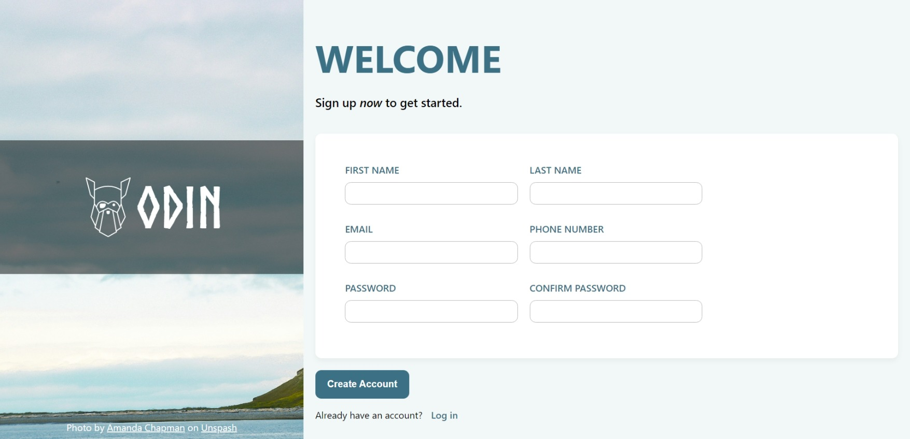

# Sign-Up Form Project

This is a **Sign-Up Form** project created as part of [The Odin Project](https://www.theodinproject.com/) Intermediate HTML and CSS curriculum. The project focuses on building a responsive and accessible sign-up form while applying intermediate-level HTML and CSS techniques.

## Features

- Fully responsive sign-up form, adaptable to various screen sizes.
- Input fields for common sign-up information:
  - First Name
  - Last Name
  - Email
  - Password
  - Password confirmation
- Styled with a modern and clean design using **Flexbox**.
- Semantic HTML structure for accessibility.
- Interactive user feedback for errors.

## Project Preview



Try the live version of the project here: [Live Preview](https://gonalgar.github.io/sign-up-form/)

## Technologies Used

- **HTML5**: Markup for structuring the form and ensuring semantic accessibility.
- **CSS3**: Styling the layout, inputs, and error states with modern techniques like CSS Grid and Flexbox.

## Getting Started

To view or modify the project locally:

1. Clone this repository:
   ```bash
   git clone https://github.com/gonalgar/sign-up-form
2. Navigate to the project directory:
    ```bash
    cd sign-up-form
3. Open the index.html file in your browser to view the form.

## What I Learned
- Building responsive and accessible forms using semantic HTML.
- Applying CSS Grid and Flexbox for form layout and styling.
- Validating form inputs and providing user feedback for errors.
- Designing a visually appealing form that adheres to modern design principles.

## Acknowledgements
This project is part of [The Odin Project Intermediate HTML and CSS](https://www.theodinproject.com/paths/full-stack-javascript/courses/intermediate-html-and-css) curriculum. It helped reinforce best practices in form development and responsive design.

## License
This project is open-source and available under the MIT License.